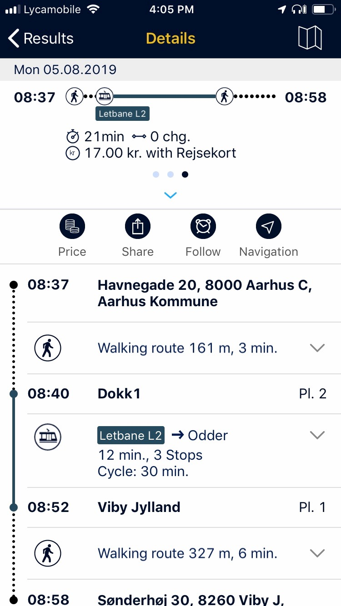
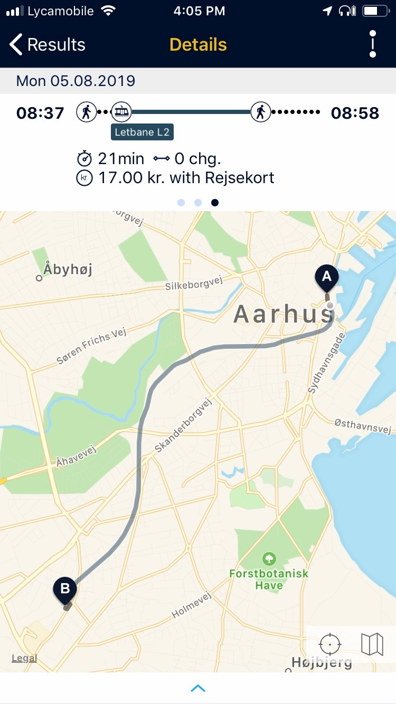
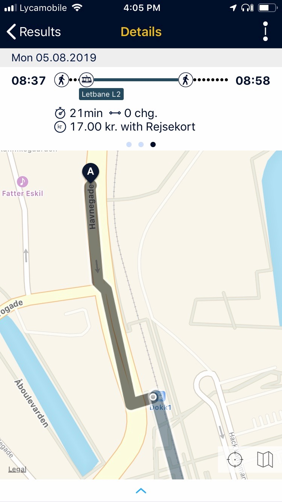
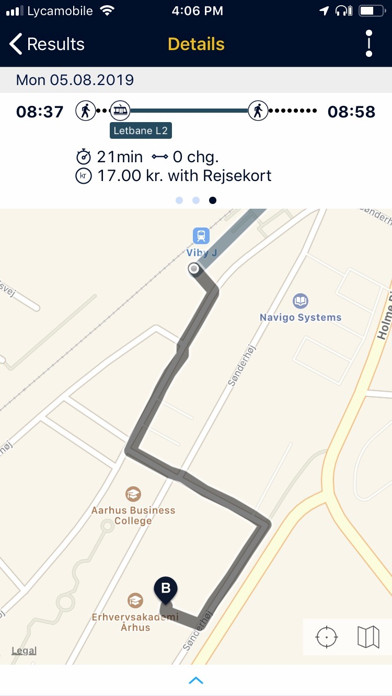
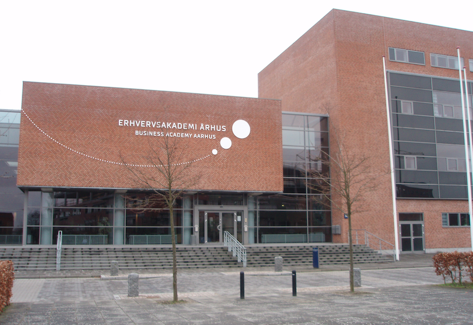

## Transit from hostel to school

Here is transit info to-and-from the hostel and school. 

 

### Summary

Use the light rail system, Letbanen. The nearest stop is at the DOKK1 building. 
* Use Line 2, which is designated **Letbane L2**.  
* Travel south to get to the school.  
* The signage on the platform and on the train will state that the train is going to Odder, which is the end of the line.  
* Exit at the Viby Jylland station. 
* Walk to the school; its address is Sønderhøj 30. 

On Monday, August 5, to get to the school by 9:00am, plan to leave the hostel about 8:30am. The train should be there at 8:40am. 

To get to the school earlier, by 8:30am, plan to leave the hostel about 8:00am. The train should be there at 8:10am. 

 

#### Midttraffik is the local transit operator

It appears that the best value for transit is to purchase a multi trip ticket (10 charges). This results in a per-trip charge of 17 DKK (which is about C$3.40). 

Get the [Midttraffik app](https://www.midttrafik.dk/english/tickets/midttrafik-app/). 

After installation, set up an account. Pay by credit card. 

Just before boarding a train, open the app, and "use" one of the tickets. 

> No multi trip ticket?  
> The per-ticket cost rises to 22 DKK (which is about C$4.40).  
> Can buy these at machines apparently (before boarding).  

 

#### Text info from the Rejseplanen app

> Look for the Rejseplanen app on your device's app store.

Here is the text info from the Rejseplanen app:

 

#### Map info from the Rejseplanen app

Here is the map info from the app:

Full route... 

 

Start, at the hostel... 

 

End, at the school...

 

Photo of the front of the school...

 
