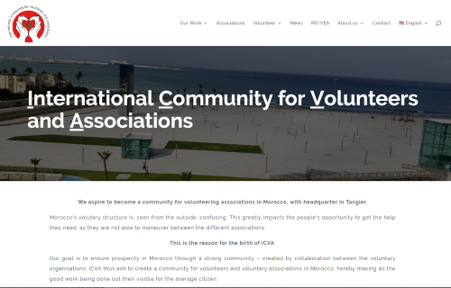
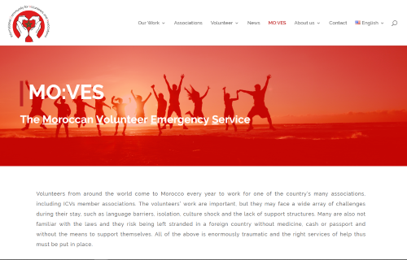

## MO:VES Project Sponsor/Client

The project sponsor or client is ICVA - the International Community for Volunteers and Associations. 

> Our goal is to ensure prosperity in Morocco through a strong community - created by collaboration between the voluntary organisations. ICVA thus aim to create a community for volunteers and voluntary associations in Morocco, hereby making all the good work being done out their visible for the average citizen.

Their web site is at [cfvaa.com](https://cfvaa.com/). Please read all content.

 

### MO:VES - Moroccan Volunteer Emergency Service

From the web site, the [MO:VES page](https://cfvaa.com/moves-2/):

> Volunteers from around the world come to Morocco every year to work for one of the country's many associations.  
> As the International Community for Volunteers and Associations in Tangier (ICVA), we take great responsibility for our volunteers' safety, while they are here. We have therefore launched MO:VES; The Moroccan Volunteer Emergency Service, which is a service under ICVA in Tangier, Morocco, providing international volunteers under ICVA, who unfortunately become victims of crime and other traumatic incidents, with immediate and comprehensive support. MO:VES works with both national and international agencies and associations to ensure that our volunteers receive extensive support in the aftermath of a crime or an accident.  
> Our help will be free and confidential and be open from the beginning of 2020, from where we will always be open to our volunteers' calls or emails if they or anyone they know requires our help.

Please read this page's content. 

 

#### Inspiration

For the MO:VES service, ICVA was inspired by the principles and goals of the [Irish Tourist Assistance Service](https://www.itas.ie/). Not an exact match for the info, features, and functionality, but the principle of providing assistance. Make sure you review that content too. 

 

#### Sofie, our local contact

Sofie Hansen is our local contact.

She works at [Den Sociale Retshjælps Fond](https://www.socialeretshjaelp.dk/) (legal aid services in Aarhus)

Email is sofie@shiningsun.dk

 
