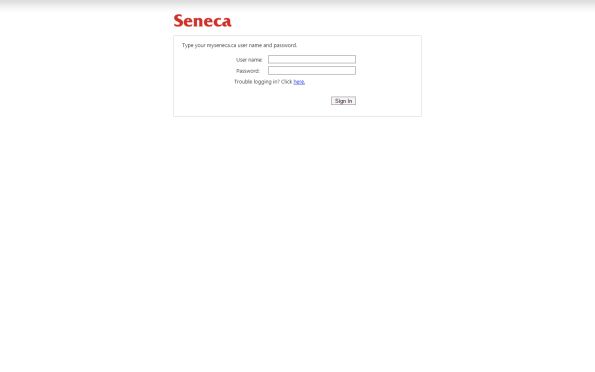
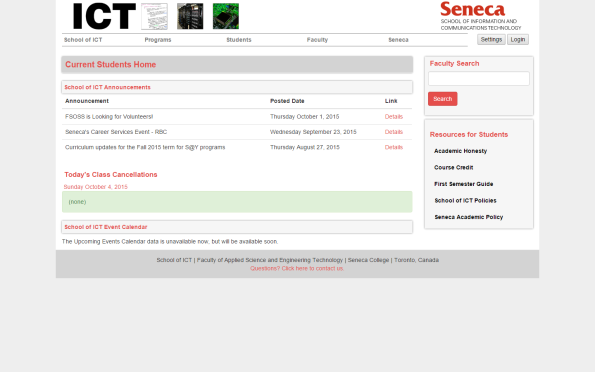
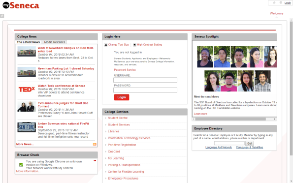
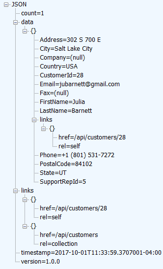
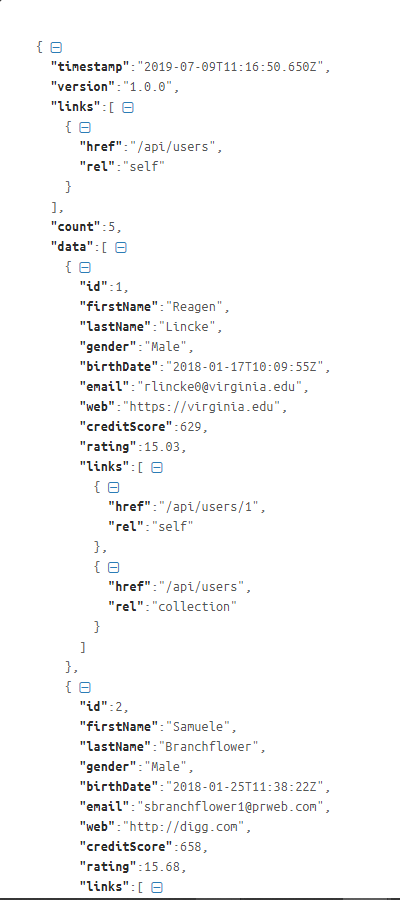

## Hypermedia representation, introduction

Modern web APIs, for public use, must be <em>hypermedia-driven</em>.

What does this mean? It means that the response will include:

<ul>
	<li>the data that you expect, and</li>
	<li><em>links</em> that enable you - the requestor - to determine what to do next.</li>
</ul>

The web API author should not have to provide out-of-band documentation or knowledge to the user of the web API.

Instead, the user of the web API should be able to "discover" functionality, found in the links, to drive the logic and workflow of their app.

This concept was identified in the <em>hypermedia constraint</em> section of Roy Fielding's PhD (doctoral) thesis, "Architectural Styles and the Design of Network-based Software Architectures".

> Who is <a href="https://en.wikipedia.org/wiki/Roy_Fielding" target="_blank" rel="noopener">Roy Fielding</a>?
> 
> He is a giant in our industry. We owe him so much.
> 
> Oh, and when you look at the list of authors of the RFC 7230 series, he's the principal author. Then, look back at the now-obsolete predecessors to this series: <a href="https://tools.ietf.org/html/rfc2616" target="_blank" rel="noopener">2616</a>, <a href="https://tools.ietf.org/html/rfc2068" target="_blank" rel="noopener">2068</a>, and <a href="https://tools.ietf.org/html/rfc1945" target="_blank" rel="noopener">1945</a>. He's on the author list on those, too.

<br>

### How can I understand this concept better?

Study the following screen capture. (Click to open it full-size in a new tab/window.)

<a href="/media/web-page-1.png" target="_blank"></a>

How do you use the page? What is its purpose? What can you do next?

Next, study the following screen capture. (Click to open it full-size in a new tab/window.)

<a href="/media/web-page-2.png" target="_blank"></a>

Again, how do you use the page? What are its purposes? What can you do next?

Finally, study the following screen capture. (Click to open it full-size in a new tab/window.)

<a href="/media/web-page-3.png" target="_blank"></a>

Again, how do you use the page? What are its purposes? What can you do next?

With all three pages - any ANY page you view in a web browser - you innately know what you can do next. You can view the content. You can click links (including the browser's "back" link). You can enter some data and process that data.

How can you implement this - <em>what can you do next?</em> - in a web service?

With link relations. 

<br>

### Where can I learn more about hypermedia-driven design?

Please read the following two documents:

1. Section 5 of Roy Fielding's <a href="http://www.ics.uci.edu/~fielding/pubs/dissertation/top.htm" target="_blank" rel="noopener">Architectural Styles...</a> PhD (doctoral) thesis.

This is a readable and understandable thesis, but some readers will need more effort to get through the recommended Section 5, "Representational state transfer" (REST). Take your time, and skim when necessary.

Near the beginning, Roy identifies the now well-known REST constraints:

> "...multiple architectural constraints are needed to guide the behavior of [software] components. REST is defined by four interface constraints: identification of resources; manipulation of resources through representations; self-descriptive messages; and, <span style="color: #ff0000;">hypermedia as the engine of application state</span>. These constraints will be discussed in <a href="http://www.ics.uci.edu/~fielding/pubs/dissertation/rest_arch_style.htm#sec_5_2" target="_blank" rel="noopener">Section 5.2</a>."

Yes, the constraints are discussed in Section 5.2. However, the hypermedia-driven concept is better explained in <a href="http://www.ics.uci.edu/~fielding/pubs/dissertation/rest_arch_style.htm#sec_5_3_3" target="_blank" rel="noopener">Section 5.3.3</a>. The last paragraph of the section brings out this idea clearly:

> "The model application is therefore an engine that moves from one state to the next by examining and choosing from among the alternative state transitions in the current set of representations. Not surprisingly, this exactly matches the user interface of a hypermedia browser. However, the style does not assume that all applications are browsers."

2. <a href="http://roy.gbiv.com/untangled/2008/rest-apis-must-be-hypertext-driven" target="_blank" rel="noopener">REST APIs must be hypertext-driven</a>, in which Roy reminds us about some design principles.

<br>

### For some, that's a tough read - is there a different version?

<a href="https://ruben.verborgh.org/" target="_blank" rel="noopener">Ruben Verborgh</a> is a professor and researcher at <a href="https://www.ugent.be/en" target="_blank" rel="noopener">Ghent University</a> in Belgium (as of October 2018).

A very readable and excellent discussion of the hypermedia constraint problem is in chapter 2 of his PhD thesis from 2014. The full thesis "<em>...investigates the obstacles for machines on the current Web, and provides solutions that aim to improve the autonomy of machine clients.</em>" Although we will not be implementing his solutions in our web services course (we will approach a solution in a different way), his chapter 2 will help us build understanding:

<a href="https://ruben.verborgh.org/phd/hypermedia/" target="_blank" rel="noopener">Chapter 2 - Hypermedia</a>

<br> 

### Conflicting opinion - it does not matter

Before continuing, we should present and discuss a conflicting opinion: <em>Hypermedia-driven design does not matter.</em>

Transforming a web service to a hypermedia-driven design takes effort, and must be done correctly. It's a lot of work.

Consider a scenario where a web service was created as part of a new system's architecture and design. Further, the web service, and the applications that use it, will be used inside an organization only. In other words, it will not be publicly-accessible. The programming teams that are developing the web service and the applications are unified, or at a minimum, they collaborate during the development process.

In this kind of scenario, the web service and the applications have knowledge of state changes, workflow, object graph shapes, and so on. Documentation is also likely shared, so the teams have a vast amount of information and understanding.

So... Does it matter in this scenario? You could argue "no" in a convincing manner.

<p style="padding-left: 30px;">Software architect Ben Morris does indeed do this, in his post...</p>
<p style="padding-left: 30px;"><a href="http://www.ben-morris.com/pragmatic-rest-apis-without-hypermedia-and-hateoas/" target="_blank" rel="noopener">Pragmatic REST: APIs without hypermedia and HATEOAS</a></p>

Please keep this in mind in the future. You may find yourself in a situation where you face this kind of choice. With a bit more experience in this and related fields, you will be able to bring value to the decision-making progress.

<br>

### Data and metadata available to the web API designer and user

The following list is a brief reminder of the list of <em>data items</em> and <em>metadata</em> that are available to web service designers and users:

<ul>
	<li>HTTP method</li>
	<li>URI</li>
	<li>Request headers</li>
	<li>Response headers</li>
	<li>Message body, in general</li>
	<li>Representation (of a resource)</li>
</ul>

Today, you will learn something about these:
<ol>
	<li>Link relations</li>
	<li>Hypermedia representations, which include additional data that enables a user/requestor to learn about the data that's needed to add a new resource</li>
</ol>

<br>

### A brief discussion of "links"...

Web client programmers are familiar with HTML "link" elements:

<ul>
	<li>a</li>
	<li>img</li>
	<li>link</li>
</ul>

You also know that the "HT" part of HTML expands to "hypertext".

So... what kind of data is at the other end of a link in HTML?

Text?

Always?

Or can it be an image, a video, or some other media?

Ah, yes, certainly the data could be <em>any kind</em> of internet media type.

Therefore, to help you make progress learning this topic, simply change your understanding (of a link target's data type) a bit, so that you begin to think of a link as a "hypermedia" link, and not just as a hypertext link.

<br> 

#### How do we use links in a web API?

In a web API, links are used to tell the requestor about <em>state transitions</em>.

In other words, they tell the requestor <em>what can be done next</em>.

For example, assume that a requestor asks for a single-item resource (e.g. a product). The web service returns a representation (the data) for that resource.

It would be nice to include data and/or metadata that would tell the requestor whether that resource could be modified, or deleted.

Or, whether it was possible to add a new resource to the resource's parent/collection.

<br>

#### Link relations

The solution is to use <em>link relations</em>. Using this solution, the response includes links that can guide the user through state transitions.

<blockquote>This is what Roy Fielding means when he writes that "hypermedia [is] the engine of application state".</blockquote>

A link is a data object, delivered in-band, <em>with</em> the representation. When you define a link in a web service, you must also define its relationship to the current object.

For example, by convention, a single object must include a link to itself:

<ul>
	<li>The value of the URI (href) will be the item's URI</li>
	<li>The value of the relationship (rel) will be "self"</li>
</ul>

If the single object is part of a collection, it must <em>also</em> include a link to its parent/collection:

<ul>
	<li>The value of the URI (href) will be the item's parent/collection</li>
	<li>The value of the relationship (rel) will be "collection"</li>
</ul>

This design ensures that the responses from your web service are self-describing.

The <a href="http://www.iana.org/assignments/link-relations/link-relations.xhtml" target="_blank" rel="noopener">IANA has published a list</a> of standardized link relations. You can create your own, but use the standard link relations until you gain more experience.

<br>
 
### Including link relations in a response

Let's briefly review the concepts discussed above:

<ul>
	<li>Modern web services must be hypermedia-driven</li>
	<li>In the response, we include information that helps the requestor understand resource state, and application state changes</li>
	<li>Link relations are used to communicate some of this information</li>
</ul>

This all sounds a bit abstract. How can we apply the concept? By creating a packaging scheme/design that includes link relations.

As you go through this section and the next section, open and study the code example.

<br>

#### Designing a "link" 

We need an object design that includes string properties for rel, href, and so on.

The idea is that we can create an instance of the object, and then custom-configure it. For example: 

```js
let link = {
  href: '/path/to/resource',
  rel: 'self' // or 'collection' etc. 
}
```

<br>

#### A package scheme/design that includes "links"

What to do with the link object? We will add it to the data that will be returned to the requestor. More about this soon. 

First, let's review your current web service experience. When returning a single item from your Node + Express app, the JSON response looks something like this:

```js
{
  "id": 4,
  "firstName": "Waldon",
  "lastName": "Morgen",
  "gender": "Male",
  "birthDate": "2018-03-02T09:53:29Z",
  "email": "wmorgen3@dailymail.co.uk",
  "web": "http://usnews.com",
  "creditScore": 742,
  "rating": 15.59
}
```

When returning a collection, the JSON response looks something like this:

```js
[{
  "id": 1,
  "firstName": "Reagen",
  "lastName": "Lincke",
  "gender": "Male",
  "birthDate": "2018-01-17T10:09:55Z",
  "email": "rlincke0@virginia.edu",
  "web": "https://virginia.edu",
  "creditScore": 629,
  "rating": 15.03
}, 
// detail was removed
{
  "id": 5,
  "firstName": "Megen",
  "lastName": "Gabbett", 
  "gender": "Female",
  "birthDate": "2018-11-21T09:29:49Z",
  "email": "mgabbett4@toplist.cz",
  "web": "https://mysql.com",
  "creditScore": 319,
  "rating": 2.67
}]
```

While these responses were OK for learning, they're not good enough for us now. 

Let's design an object that will hold the data and the links - in other words, a packaging scheme or design, known as a custom "hypermedia representation". 

Are there standards we can follow? Well, there are no universally-used <em>de facto</em> standards. For our purposes, we can design our own. Consider the following scheme or design for an object with these key-value pairs:

Key name | Data type | Comments
--- | --- | ---
timestamp | string | Current date-and-time, as an ISO 8601 string
version | string | Version number identifier (for future use)
links | array of link objects | Package-level controls
count | number | Item count being returned
data | array of item(s) | Data items, each one includes a "links" collection

<br>

<strong>Metadata properties, timestamp, version, and count</strong>

As their name suggest, these properties provide useful information about the representation.

"count" provides an easy top-level and calculation-free way for the requestor to determine how many items are in the collection. A "get one" will return "1". A "get all" will return zero or more.

"version" is programmer-provided, and can be an easy way to tell the requestor about the version number of the representation.

<br>

<strong>The "data" property</strong>

The "data" property holds the data to be returned (zero or more items). Each item includes a collection of links, which gets custom-generated.

Each item will also have its own new "links" property. By convention, we always include two links here, to self and to the collection. 

<br>

<strong>The "links" property</strong>

The "links" property holds one or more link relations that are relevant for the requested resource. For example, a collection resource will typically have only one, pointing to the collection as "self". Alternatively, an object (one of / get one) resource will typically have at least two - one points to "self", and the other to the parent (enclosing) collection.

<br>

<strong>Example of "get one"</strong>

Here's what "get one" could look like:

<a href="/media/hr-for-item.png" target="_blank"></a>

<br> 

<strong>Example of "get all"</strong>

Here's what "get all" could look like (just the top part):

<a href="/media/hr-for-collection.png" target="_blank"></a>

<br>
